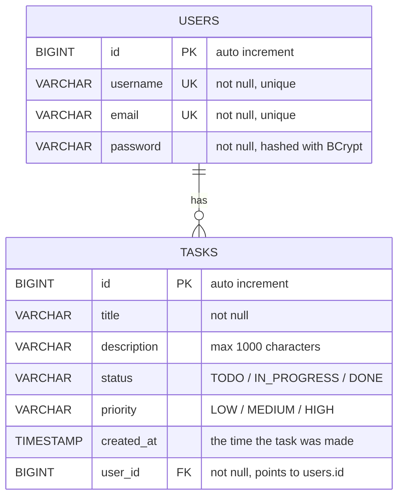

# The ERD of the database

My database has only two tables, `users` and `tasks`.
Hibernate makes them from the entity classes because I put
`spring.jpa.hibernate.ddl-auto=update` in the properties file.

## The diagram



## The relation

One user can have many tasks, but one task belongs to one user only.
This is a **one to many** relation. In my code it is the `@ManyToOne` on the
`user` field inside `Task.java`, and it makes the `user_id` column in the
`tasks` table.

This `user_id` column is the reason every user sees only his own tasks. Every
method in `TaskRepository` takes the user with it, like
`findByUserAndStatus(user, status)`, so the database never gives me the tasks
of somebody else.

## The tables in SQL

This is the SQL that Hibernate makes. I put it here only so the tables are clear,
you do **not** need to run it, the app makes them alone when it starts.

```sql
CREATE TABLE users (
    id       BIGSERIAL    PRIMARY KEY,
    username VARCHAR(255) NOT NULL UNIQUE,
    email    VARCHAR(255) NOT NULL UNIQUE,
    password VARCHAR(255) NOT NULL
);

CREATE TABLE tasks (
    id          BIGSERIAL     PRIMARY KEY,
    title       VARCHAR(255)  NOT NULL,
    description VARCHAR(1000),
    status      VARCHAR(255)  NOT NULL,
    priority    VARCHAR(255)  NOT NULL,
    created_at  TIMESTAMP,
    user_id     BIGINT        NOT NULL,
    CONSTRAINT fk_tasks_user FOREIGN KEY (user_id) REFERENCES users (id)
);
```

## Why the enums are saved as text

I wrote `@Enumerated(EnumType.STRING)` on `status` and on `priority`.

If I do not write it, JPA saves the number of the enum (0, 1, 2) and not the text.
The problem is that if one day I add a new value in the middle of the enum, all the
old rows become wrong. And the text `TODO` is also much easier to read when I open
the database myself.
